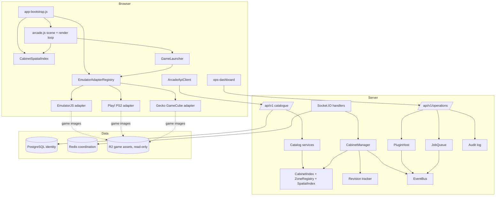

# Phase 11 — Architecture and Deliverables

Companion documents:

- `phase-11-inspection-and-migration-plan.md` — the pre-implementation
  inspection, the gap analysis, and the staged plan
- `phase-11-benchmarks.md` — measured cabinet-registry performance
- `phase-11-socket-protocol.md` — the multiplayer socket contract
- `phase-11-security-review.md` — Milestone 11.38

## 1. Architecture summary

Phase 11 turned the arcade into a modular platform along four seams.

**Cabinets no longer know emulators exist.** A cabinet definition names a game
ID. The game names a launcher and an emulator adapter. The launcher resolves
both and drives a session. `arcade.js` — which previously held core selection,
three iframe URL shapes, and two postMessage protocols inline — now contains no
emulator knowledge at all, enforced by a guard test.

**The registry is indexed, not scanned.** Cabinets are indexed by ID, zone,
game, and type, and spatially hashed on a uniform grid. Room state is
materialized per cabinet on first use and dropped on release. Snapshots are
zone-scoped and revision-stamped; changes travel as deltas.

**Optional features register through a permissioned plugin host** instead of
requiring edits to core files.

**Operators have their own authenticated surface**, and the platform exposes a
versioned, validated API that route handlers reach through services.

## 2. System diagram



## 3. Cabinet → game → emulator sequence

```mermaid
sequenceDiagram
  participant P as Player
  participant C as CabinetInteractionController
  participant S as Server CabinetManager
  participant L as GameLauncher
  participant R as EmulatorAdapterRegistry
  participant A as EmulatorAdapter
  participant F as Emulator iframe

  P->>C: press E near a cabinet
  C->>S: cabinet:request-use
  S->>S: check enabled, ownership, cooldown, distance
  S-->>C: approved + alignment (revision bumped)
  C->>L: launch(cabinetId)
  L->>L: resolve cabinet, then game
  L->>R: resolveForGame(game)
  R-->>L: adapter (or refuse; never substitute)
  L->>A: preflight(context)
  A-->>L: ok, or missing-assets / desktop-only
  L->>A: createSession -> start
  A->>F: mount frame (URL from adapter)
  F-->>A: arcade:emulator-ready
  A->>F: source handshake (wasm cores only)
  Note over L,F: any failure disposes the session<br/>and releases the cabinet
  P->>C: exit
  C->>L: stop(player-exit)
  C->>S: cabinet:release
```

## 4. GameLauncher

`games/game-launcher.js`. The single path from interaction to running game.

`resolve(cabinetId)` is separated from `launch()` so the interaction layer can
decide what to show *before* any download begins, and so the whole chain is
testable without a browser. `launch()` runs: resolve → entitlement →
preflight → createSession → start. Every failure after the session exists
disposes it before returning, so a refused or broken launch cannot strand a
cabinet reserved. `stop()` is idempotent.

Failure reasons are enumerated and each maps to a player-facing message:
`unknown-cabinet`, `cabinet-disabled`, `no-game-assigned`, `unknown-game`,
`game-disabled`, `unknown-adapter`, `platform-unsupported`, `not-entitled`,
`preflight-failed`, `start-failed`.

The entitlement gate ships as an allow-all default, because the competitive
layer it would consult does not exist in this repository.

## 5. Emulator adapter interface

`emulators/emulator-adapter.js`. Adapters are **policy**; the host runtime is
**mechanism**. Nothing under `emulators/` touches `document`, `window`,
`createObjectURL`, or `postMessage`, which is what makes the chain unit-testable
without a browser and is enforced by a test.

Members: `id`, `supportedPlatforms`, `capabilities`, `usesSourceHandshake`,
`preflight`, `describeFrame`, `initialHandshake`, `interpretMessage`,
`warmupAssets`, `createSession`, `start`, `stop`, `dispose`. A misdeclared
adapter is refused at registration, not at a cabinet.

### Capability matrix

Every capability defaults to false and must be opted into.

| Capability | EmulatorJS | Play! (PS2) | Gecko (GameCube) |
|---|---|---|---|
| saveStates | false | false | false |
| inputRecording | false | false | false |
| deterministicReplay | false | false | false |
| memoryInspection | false | false | false |
| screenshotCapture | false | false | false |
| scoreExtraction | false | false | false |
| pauseSupport | false | false | false |
| controllerRemapping | false | false | false |
| audioControl | false | false | false |

All false is the honest answer, not an oversight. Save states and pause exist
inside EmulatorJS's own UI, but nothing crosses the iframe boundary to us, so
declaring them would be exactly the false claim Milestones 11.4 and 11.20 warn
against.

## 6. Game session lifecycle

`server/src/domain/game-session.ts`.

```
CREATED → PREFLIGHT → READY → STARTING → ACTIVE ⇄ PAUSED
                                            ↓
   (any state) ──────────────────────→ STOPPING → COMPLETED → DISPOSED
                                            └──→ FAILED ────→ DISPOSED
```

Transitions are validated against a table; an invalid edge throws rather than
coercing. `stop()` and `dispose()` are idempotent and preserve the first stop
reason, because cabinet release, socket disconnect, and emulator error all race
to end the same session. Sessions are frozen, so no caller can mutate one.

`competitiveAttemptId`, `replayCaptureStatus`, and `scoreSubmissionStatus` are
declared seams for Phase 12 and never advance past their initial values.

## 7–10. Plugins

**Manifest** (`plugin-manifest.ts`): `id`, `name`, `version`, `apiVersion`,
`description?`, `entrypoints`, `permissions`, `dependencies?`, `capabilities`,
`configurationSchema?`, `critical?`. Validated for a unique ID, semantic
version, supported API version (same major, not a newer minor), dependency
compatibility, allowed permissions, valid entrypoints, configuration, and
duplicate registration.

Entrypoints must be relative `.js`/`.mjs` paths inside the plugin directory.
Absolute paths, URLs, and traversal are refused. That check, plus the
fixed-in-source path map in `plugin-bootstrap.ts`, is what keeps "install a
plugin" from meaning "run arbitrary remote code".

**Permission model** (`plugin-permissions.ts`): twelve grants, listed in
`docs/phase-11-security-review.md`. What is absent is the point — no grant
exists for a database client, Redis client, filesystem, cookies, wallet
signatures, keys, secrets, ROMs, or tokens. Enforcement is at each call.

**Lifecycle** (`plugin-host.ts`): discovered → validated → initialized →
started → stopped → disposed, with failed and disabled as terminal states. All
plugin code runs inside a containment wrapper; a noncritical failure marks that
plugin failed and the host continues. Only `critical: true` turns a plugin's
failure into a startup failure.

**Storage** (`plugin-storage.ts`): `arcade:plugin:{pluginId}:{key}`, prefix
applied by the layer and never caller-supplied. Quotas bound key count, value
size, and total bytes. Backends: in-memory and filesystem, behind one interface.

**Example plugin** (`plugins/example-info-kiosk/`): manifest, configuration
schema with defaults, server and client entrypoints, lifecycle, least-privilege
permissions, namespaced storage, logging, cleanup, and tests. Deliberately
boring — it reads room population and counts views.

## 11–14. Cabinet scale

**Indexing** (`cabinet-index.ts`): maps by ID, zone, game, and type, built once
at load, with frozen shared buckets so a hot lookup allocates nothing.

**Spatial index** (`cabinet-spatial-index.ts`): a 2D uniform grid over the X/Z
plane, 8 m cells. The arcade is one indoor floor at a single height, so a
quadtree or octree would add depth without shrinking the candidate set; the
even spacing along walls is exactly the distribution a uniform grid suits. An
8 m cell against a 2.6 m interaction radius means a query touches at most 4
cells at any registry size. Build O(n), query O(k) for k cabinets in the
overlapping cells, memory O(n + c) with empty cells never allocated.

**Zone streaming** (`zone-registry.ts`): bounds derived from the cabinets a zone
contains, so a zone cannot drift out of sync with its contents. Adjacency is
computed from bounds within preload distance. `activeZoneIds` resolves by
distance, so crossing a boundary never yields a frame with nothing loaded.

**Snapshot and delta** (`cabinet-delta-publisher.ts`): a join receives only the
zones around the player, stamped with a revision. Each change carries the
revision it produces. A client applies a delta only at `clientRevision + 1`;
a duplicate is dropped, a gap triggers `cabinet:resync`. Unchanged state is
never broadcast. Static metadata never travels on this channel.

Measured results in `phase-11-benchmarks.md`: **10,000 definitions** with a
bounded per-frame query, ~227× faster than the scan it replaces.

## 15–18. Replay and ghost — deferred

Not implemented. Deferred to Phase 12 by operator decision, for the reasons in
§2 of the inspection document: there is no competitive layer, no score
extraction, and three opaque emulator iframes. Tests 26–35 of Milestone 11.40
are out of scope for this phase.

The vocabulary is declared where it is structurally required —
`ReplayCapability` on every `GameDefinition` (all `NONE`), and the three seam
fields on `GameSession` — so Phase 12 extends rather than reshapes.

## 19–21. Operations

**Dashboard** (`ops-dashboard/`): overview, servers, rooms, cabinets, plugins,
replays, actions, and audit. Served only when operators are configured. No chat,
message, or moderation surface anywhere.

**Authorization model**: a separate credential store, three roles —
`viewer` (read), `operator` (read + act), `admin` (read + act + administer).
Authorization is server-side on every route; the dashboard hides nothing on its
own. Sessions are HttpOnly, SameSite=Strict, expiring, and revocable. CSRF is
required on every state-changing request.

**Actions**: ten enumerated handlers. Each validates permission, then state,
supports dry run, is idempotent and reports a no-op, and produces an audit
record — including on refusal.

**Audit model**: operator, action, target type and ID, reason, previous state,
resulting state, timestamp, request ID, success, failure reason, deployment
version, and dry-run flag. The log refuses to write anything secret-shaped, with
a depth-bounded scan.

## 22–25. API, socket, client, jobs

**Backend API**: `/api/v1` with `platform`, `cabinets`, `zones`, `games`, and
`world/active-zones` public reads, plus `/api/v1/operations`. Every response
carries `apiVersion` and `requestId`. Errors are a single envelope with a typed
code; stack traces never reach a client. Pagination is cursor-based and clamped.
DTOs are hand-written allowlists.

The `/api/v1` 404 handler is installed once, after every versioned router. A
catch-all inside a feature router swallows sibling namespaces — that is how the
operations API briefly disappeared behind the catalogue during Stage G.

**Socket protocol**: documented separately in `phase-11-socket-protocol.md`.

**Typed API client** (`client/api/api-client.js`): one base URL, one error type,
one place that knows about credentials, request IDs, idempotency, retries, and
cancellation. Retries cover safe methods and writes carrying an idempotency key,
never a bare POST. Concurrent identical reads share one request.

**Background jobs** (`jobs/job-queue.ts`): retries with capped exponential
backoff, dead-letter handling, idempotent processors keyed by the caller,
metrics, operator visibility, no infinite retries, safe shutdown. In-memory for
Phase 11 and honest about it — `durable` reports `false`, and jobs do not
survive a restart.

**Event bus** (`events/event-bus.ts`): a closed event map with one publishing
subsystem per event. Delivery is synchronous, in subscription order, and
best-effort; a throwing subscriber is contained and counted. Nothing here is
durable — work that must survive process failure belongs in the job queue.

## 26–29. Migrations, keys, storage, environment

**Database migrations: none.** Phase 11 added no tables. Operator credentials
live in the environment by design (§ operator authorization), plugin storage is
filesystem-backed, and the audit log is in-memory with a structured-log sink.
Phase 12 will need tables for replay records and durable audit retention.

**Redis key additions: none at runtime.** The plugin namespace
`arcade:plugin:{pluginId}:*` is defined and used by the storage layer; the
shipped backend is the filesystem, so no new Redis keys are written yet. The
prefix is reserved so a Redis backend slots in without collision.

**Object storage**: unchanged. R2 remains read-only for game assets; Phase 11
adds no upload path.

**New environment variables** (all bounded and typed in `config.ts`):

| Variable | Default | Meaning |
|---|---|---|
| `ENABLED_PLUGINS` | empty | Comma-separated plugin IDs to load. Empty means none. |
| `PLUGIN_STORAGE_DIR` | `.plugin-storage` | Filesystem root for plugin storage. |
| `PLUGIN_STORAGE_MAX_KEYS` | 500 | Per-plugin key quota. |
| `PLUGIN_STORAGE_MAX_TOTAL_BYTES` | 1048576 | Per-plugin byte quota. |
| `OPERATIONS_OPERATORS` | unset | `id:role:token` entries, comma-separated. Unset disables operations entirely. |
| `OPERATIONS_SESSION_TTL_SECONDS` | 28800 | Operator session lifetime. |

## 30. Automated test results

**273 passing, 0 failing, lint clean.** Baseline before Phase 11 was 115.

| Suite | Covers |
|---|---|
| `cabinet-domain-model` | 11.1, 11.39 ID stability |
| `game-domain-model` | 11.2, 11.40 tests 1–5 |
| `game-session-model` | 11.6, 11.40 tests 6–7 |
| `emulator-adapters` | 11.4, 11.5, 11.40 tests 2, 5 |
| `emulator-decoupling` | 11.40 test 3 |
| `game-launcher` | 11.3, 11.40 tests 1, 4, 7, 8 |
| `cabinet-scale` | 11.13, 11.15, 11.40 tests 18–20, 23 |
| `cabinet-deltas` | 11.14, 11.40 tests 21–22, 25 |
| `plugin-architecture` | 11.7–11.11, 11.40 tests 9–17 |
| `example-plugin` | 11.12 |
| `operations`, `operations-http` | 11.25–11.29, 11.40 tests 36–41 |
| `api-platform`, `api-client` | 11.30–11.36, 11.40 tests 42–48, 50 |
| pre-existing suites | 11.40 tests 51–60, all still passing untouched |

**Not covered:** tests 26–35 (replay), deferred with the system. Test 49
(socket schema validation) is covered by the closed protocol unions and existing
socket tests rather than a new suite.

`tools/browser-smoke.mjs` additionally boots headless Chromium against a running
server, enters the arcade as a guest, and asserts adapter wiring, honest
capabilities, and the live spatial index — because `arcade.js` has no unit
coverage and is the file Phase 11 changed most.

## 31. Performance benchmark results

See `phase-11-benchmarks.md`. Summary: 10,000 definitions build in ~21 ms;
indexed lookups stay sub-microsecond and flat; the per-frame nearby query is
~227× faster than the full scan it replaces and visits 4 cells regardless of
registry size.

## 32. Security review findings

See `phase-11-security-review.md`. Two findings, both fixed in this phase: an
audit-write failure that hung the request and risked an unhandled rejection, and
body-parser rejections reported as 500 rather than 413/400.

## 33. Known limitations

1. **`arcade.js` still has no unit coverage.** It is one 125 KB module that only
   runs against a real WebGL context. The browser smoke test covers boot and
   wiring, not gameplay.
2. **The job queue is not durable.** Jobs are lost on restart. It reports
   `durable: false`; nothing that must survive a failure should be enqueued
   until a durable backend exists.
3. **Operator sessions are in-memory.** A restart signs everyone out, and
   sessions are not shared across server instances.
4. **The audit log is in-memory and bounded** at 2,000 records with oldest-first
   eviction. Records are also emitted to the structured log, which is where
   long-term retention should come from today.
5. **Zone streaming is server-side only.** The server sends zone-scoped
   snapshots and the client can query active zones, but `arcade.js` still builds
   every cabinet mesh at scene construction. Lazy scene-object creation is
   designed and indexed but not wired into the render path.
6. **Cabinet definitions still load from JSON**, not a database. The loader is
   behind a function so a database source is a swap, but that swap is not made.
7. **`GameSession` is not yet persisted or server-authoritative.** Sessions are
   a client-side concept in Phase 11; the server tracks cabinet occupancy.

## 34. Remaining technical debt

- `arcade.js` remains a monolith with very long lines; the Phase 11 seams are
  wired into it rather than through it.
- The unversioned `/api/*` routes and the legacy `cabinet:snapshot` /
  `cabinet:state-changed` events are compatibility surface that should be
  removed once clients have migrated (Milestone 11.39 permits removal only after
  testing and documentation).
- `GameCatalogService.replaceRegistry` exists because the registry-refresh
  action must swap two holders; a single owning service would be cleaner.
- The operations dashboard has no auto-refresh; it is manual-refresh only.
- Plugin client entrypoints are declared and validated but not yet loaded by the
  browser bootstrap.

## 35. Deployment and rollback

**Deployment is unchanged**: the same Docker image and the same `/ready` health
check on Fly, DigitalOcean, and Render.

**Phase 11 is inert by default.** With no new environment variables set, no
plugins load, operations endpoints exist but can never authenticate, the
dashboard is not served, and the client behaves exactly as before. Enabling
Phase 11 features is opt-in per variable.

**Rolling out:**

1. Deploy with no new variables. The versioned API and the new socket events
   ship, but nothing changes for players.
2. Verify `/api/v1/platform` returns the expected counts and `/metrics` shows
   the new gauges.
3. Set `OPERATIONS_OPERATORS` to enable the dashboard. Verify a viewer cannot
   act.
4. Set `ENABLED_PLUGINS=example-info-kiosk` to exercise the plugin host.

**Rollback:** unset the new variables — no data migration reverses, because
Phase 11 adds no tables. To roll back the code, redeploy the previous image.
The only forward-incompatible change is `assets/games/registry.json` moving to
version 2; the pre-Phase-11 client validates `version === 1` and would refuse
it. If rolling back the server image, also revert that file, or note that the
v2 loader accepts both versions so rolling *forward* is always safe.

**Registry refresh without a deploy:** `registry.refresh` reloads game
definitions from disk in place, audited like any other action.

## 36. Recommended safest scope for Phase 12

Not a proposal to proceed — Phase 12 requires explicit approval.

The safest scope is **finishing what Phase 11 deliberately left seamed**, in
this order:

1. **Client-side zone streaming.** The server already sends zone-scoped
   snapshots and the client already has a spatial index; wiring lazy scene-object
   creation into `arcade.js` completes 11.16 and is the highest-value remaining
   work. Self-contained, no new subsystems.
2. **Durable job queue and audit persistence.** Both are behind interfaces and
   both are currently the honest-but-limited implementation. This is the
   prerequisite for anything asynchronous.
3. **Server-authoritative game sessions.** Move `GameSession` from a client
   concept to a server-tracked one. This is the real prerequisite for replay,
   and it is worth doing on its own merits.

**Replay (11.17–11.24) should not be attempted until (3) lands**, and even then
its honest scope is `INPUT_LOG` at best. Deterministic replay is not reachable
through the current iframe boundary with any of the three emulators, and no
amount of Phase 12 work changes that without replacing a core — which the brief
forbids.

**Do not attempt the competitive or leaderboard layer** as part of finishing
replay. It is a separate product decision with monetization implications, and
Phase 11's brief explicitly excluded it.
